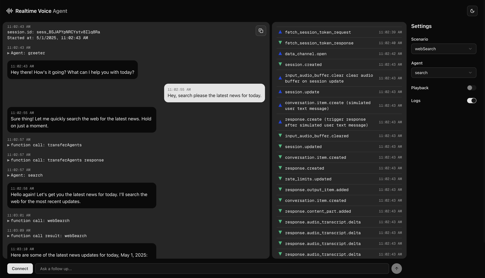

<a href="https://voice-oss.vercel.app">
  
  <h1 align="center">Voice</h1>
</a>

<p align="center">
  An Open-source Realtime AI Voice Agent Built With Next.js, and OpenAI. 
</p>

This demonstrates:

- Sequential agent handoffs according to a defined agent graph (taking inspiration from [OpenAI Swarm](https://github.com/openai/swarm))
- Background escalation for high-stakes decisions
- Prompting models to follow a state machine, for example to accurately collect things like names and phone numbers with confirmation character by character to authenticate a user.

<p align="center">
  <a href="#features"><strong>Features</strong></a> ·
  <a href="#model-provider"><strong>Model Provider</strong></a> ·
  <a href="#deploy-your-own"><strong>Deploy Your Own</strong></a> ·
  <a href="#running-locally"><strong>Running locally</strong></a>
</p>
<br/>

## Features

- [Next.js](https://nextjs.org) App Router
  - Advanced routing for seamless navigation and performance
  - React Server Components (RSCs) and Server Actions for server-side rendering and increased performance
- [OpenAI](https://openai.com/) Integration
  - Leverages OpenAI's powerful models for chat generation.
  - Direct API calls for text generation and other AI features.
  - Web search capabilities through OpenAI's Response API for real-time information retrieval
- [Jina Reader](https://jina.ai/) Integration
  - Advanced web scraping capabilities for extracting structured data from websites
  - Enhances the AI's ability to process and understand web content
- [shadcn/ui](https://ui.shadcn.com)
  - Styling with [Tailwind CSS](https://tailwindcss.com)
  - Component primitives from [Radix UI](https://radix-ui.com) for accessibility and flexibility

## Model Provider

This app utilizes the [OpenAI API](https://openai.com/) for its AI capabilities. It is configured to use OpenAI models for generating responses.

## Deploy Your Own

You can deploy your own version of the OpenChat to Vercel with one click:

[](https://vercel.com/new/clone?repository-url=https%3A%2F%2Fgithub.com%2Fmuradpm%2Fvoice&env=OPENAI_API_KEY,JINA_API_KEY&envDescription=Learn%20more%20about%20how%20to%20get%20the%20API%20Keys%20for%20the%20application&envLink=https%3A%2F%2Fgithub.com%2Fmuradpm%2Fopenchat%2Fblob%2Fmain%2F.env.example&demo-title=Voice&demo-description=An%20Open-source%20Realtime%20AI%20Voice%20Agent%20Built%20With%20Next.js&demo-url=https%3A%2F%2Fvoice-oss.vercel.app)

## Running locally

You will need to use the environment variables [defined in `.env.example`](.env.example) to run OpenChat. It's recommended you use [Vercel Environment Variables](https://vercel.com/docs/projects/environment-variables) for this, but a `.env` file is all that is necessary.

> Note: You should not commit your `.env` file or it will expose secrets that will allow others to control access to your various OpenAI and authentication provider accounts.

1. Install Vercel CLI: `npm i -g vercel`
2. Link local instance with Vercel and GitHub accounts (creates `.vercel` directory): `vercel link`
3. Download your environment variables: `vercel env pull`

```bash
bun install
bun dev
```

Your app should now be running on [localhost:3000](http://localhost:3000/).
